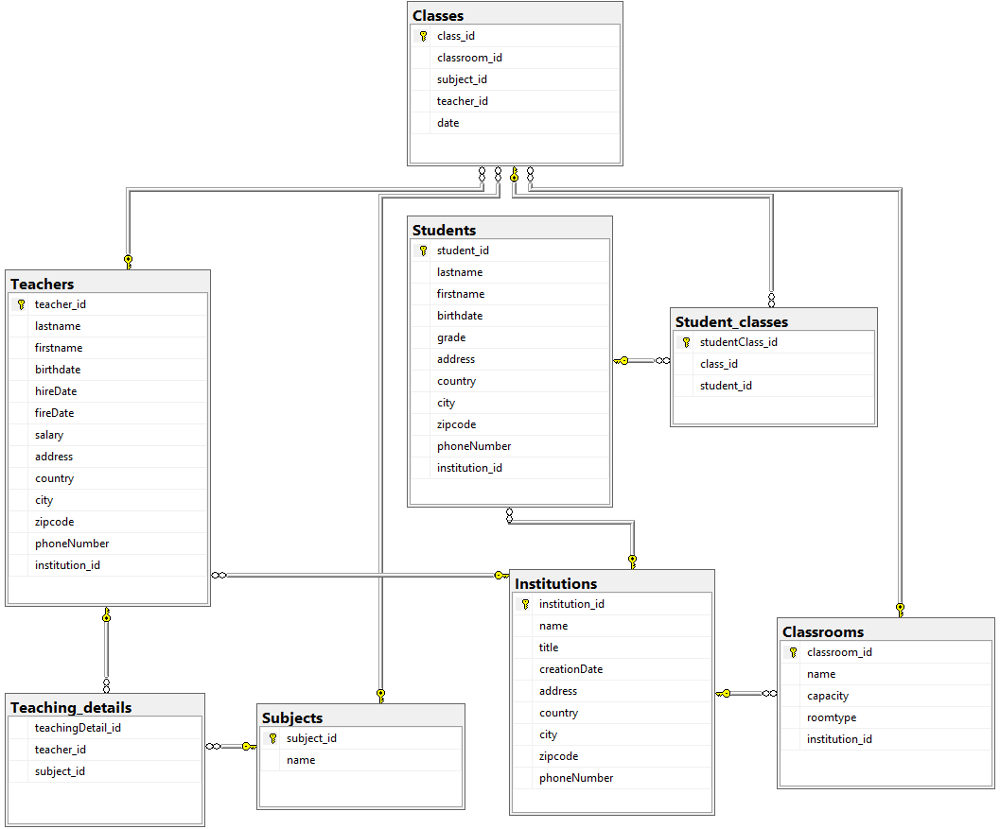

# Equipe7
## SQL project

Notre projet sql a pour thème l'école.

- Pour construire la base de donnée : [Création](/scripts/crea-base.sql)
- Pour le remplissage de la base de donnée : [Remplissage](/scripts/filling-base.sql)
- Pour le requêtage de la base de donnée : [Requêtes](/scripts/request.sql)

Orchestré par Mathieu-Malory-Léa-Cyrian

